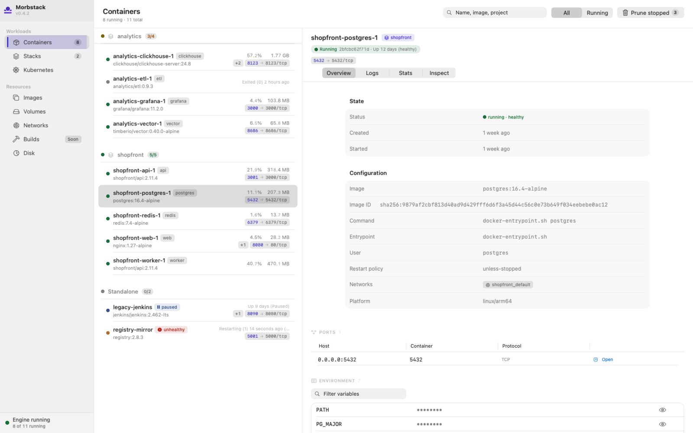
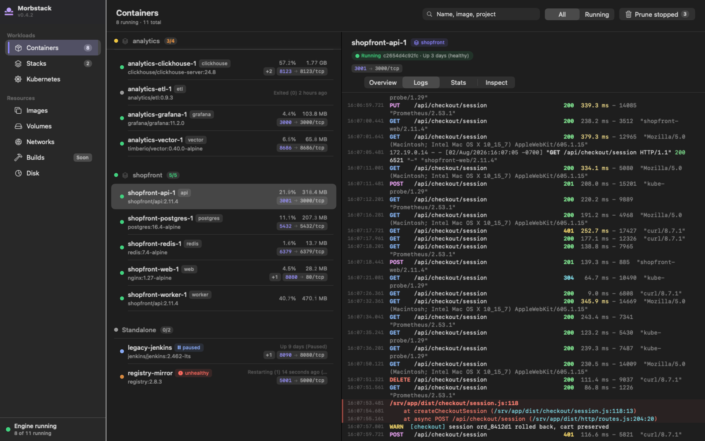
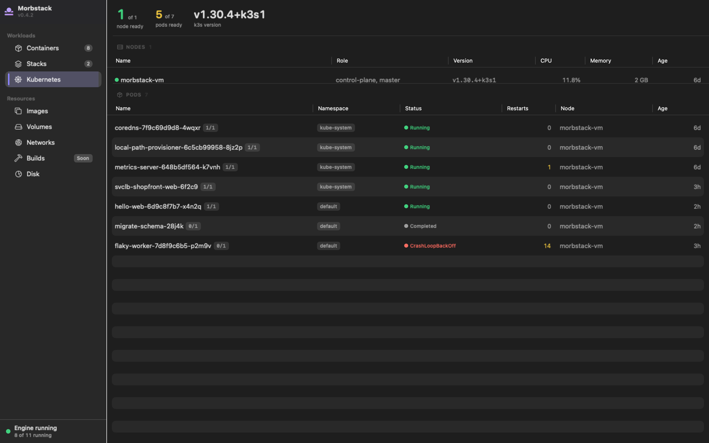
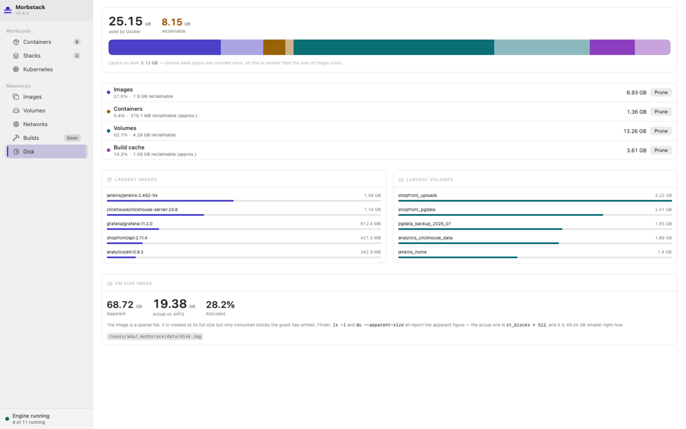
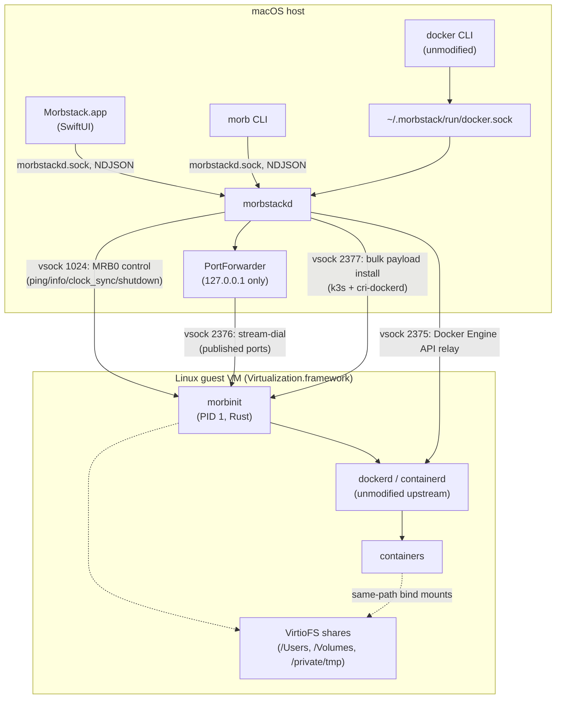

<picture>
  <source media="(prefers-color-scheme: dark)" srcset="brand/out/wordmark-dark.png">
  
</picture>

**The Docker you wish Docker shipped.**

Morbstack is a free, Apache-2.0, native replacement for Docker Desktop on
macOS. It runs unmodified upstream `dockerd`/`containerd` inside a single
shared, lightweight Linux VM powered by `Virtualization.framework`, with
everything else — the CLI, the daemon, and the app — thin, native Swift
glue.

<!--
  TODO(human): the CI badge URL below assumes the repo is published as
  github.com/morbstack/morbstack (see docs/PUBLISHING.md). Update the
  org/repo once that's decided, and this comment stops being needed.
-->
[](LICENSE)
[](https://github.com/morbstack/morbstack/actions/workflows/ci.yml)


- **Free forever**, Apache-2.0 — no license nags, no seat count, no
  "personal use only."
- **No account.** Nothing to sign in to, nothing phoning home to gate a
  feature.
- **No telemetry.** Verified by grepping `mac/Sources` for any
  analytics/telemetry SDK: there isn't one. (The only hits for words like
  "analytics" or "sentry" in that tree are fixture strings the demo
  screenshot harness uses to fake a realistic container list — not code
  that runs, and not data that goes anywhere.)
- **Unmodified upstream `dockerd`.** Morbstack doesn't fork or patch
  Docker Engine — it fetches the real static Docker release binaries and
  runs them, so the API surface, the CLI, and Compose files behave the
  way real Docker does. See [`docs/compat.md`](docs/compat.md).
- **Native SwiftUI, zero web views.** The app is AppKit/SwiftUI, not an
  embedded browser — see "The five differentiation domains" in
  [`docs/architecture.md`](docs/architecture.md).

## Status: pre-release (milestone M0)

Morbstack is not yet something you run containers with day to day. There
is no packaged app or DMG yet (see "Install" below), and real gaps remain
— read this section before trying it, not after something breaks.

**What works**, per [`docs/roadmap.md`](docs/roadmap.md)'s M0 gates, all
verified end to end against a real cold-booted VM (see
[`docs/parity.md`](docs/parity.md) for the full audit):

- `docker run`, `docker exec`, `docker logs`, `docker cp`, `docker stats`,
  `docker events`, `docker system df/prune` — the core CLI, byte-for-byte
  the same shape of output as real Docker.
- Published ports (`docker run -p`), reachable from the Mac.
- Container outbound networking (NAT) and disk persistence across a
  `morb stop`/`morb start` cycle.
- `docker compose up -d` — multi-service projects, healthchecks,
  `depends_on: condition: service_healthy`, named volumes, custom
  networks.
- VirtioFS bind mounts, same-absolute-path mapping — see
  [`docs/sharing.md`](docs/sharing.md).
- amd64 images via Rosetta — verified with `mysql:5.7`, which ships no
  arm64 manifest at all — see [`docs/amd64.md`](docs/amd64.md).
- A local Kubernetes cluster (`morb k8s enable`), wired to the same
  `dockerd` everything else uses, off by default — see
  [`docs/k8s.md`](docs/k8s.md).
- Docker-in-Docker via the bind-mounted socket, OOM/disk-full failure
  modes matching real Docker's contract, and restart policies surviving
  a daemon restart.

**What does not work yet** — the honest list, not softened:

- **No packaged app.** You build from source (below). No DMG, no
  Homebrew cask yet.
- **No `host.docker.internal` / `gateway.docker.internal`.** Not
  degraded — completely absent. (The underlying network path to the Mac
  does exist via the VM's own gateway IP, but nothing exposes it as a
  stable, documented hostname yet.)
- **No zero-config socket discovery.** You must `export DOCKER_HOST=...`
  or create a `docker context` by hand — nothing registers one for you
  automatically the way Docker Desktop's installer does.
- **No `docker buildx` shipped.** The guest's BuildKit is fully
  functional once a client-side `docker-buildx` binary exists — it just
  isn't fetched or installed by this repo yet, so `docker build`'s
  modern BuildKit-by-default path fails out of the box.
- **No inotify across a VirtioFS bind mount.** A host-side edit is
  correct the instant you read it, but hot-reload watchers (`nodemon`,
  `webpack --watch`, `vite`) never see the change-notification event.
  `--legacy-watch`/polling-based watchers work as a mitigation.
- **The `/tmp` vs `/private/tmp` footgun.** `/tmp` on macOS is a symlink
  to `/private/tmp`; a bind mount written against the unresolved
  `/tmp/...` path silently mounts an *empty directory* instead of your
  file, with no error. Use `/private/tmp/...` (`morb doctor` flags this
  too).
- **No UDP port forwarding**, and no `morb.local` DNS/domains.

[`docs/parity.md`](docs/parity.md)'s own tally, from a live audit against
a real guest, not simulated: **20 PASS, 3 PARTIAL, 6 FAIL** out of 29
checks — read it for the full list, including behavioral differences
from real Docker that pass every manual test and then break exactly one
person's CI script (a `docker run -p` against an already-bound host port
succeeds where Docker Desktop fails synchronously, for example).

## Screenshots

Real offscreen renders of the shipping SwiftUI views (not mockups — the
capture harness links the same `MorbstackAppCore` target the app ships),
shown with demo fixture data, not a live engine.

<table>
<tr>
<td></td>
<td></td>
</tr>
<tr>
<td></td>
<td></td>
</tr>
</table>

## Requirements

- **Apple silicon.** `Virtualization.framework`'s Rosetta-backed amd64
  path and this project's own testing both assume arm64; there is no
  Intel Mac support story.
- **macOS 15 (Sequoia) or later** to run Morbstack — `mac/Package.swift`
  declares a `macOS(.v15)` deployment target and `Info.plist` sets
  `LSMinimumSystemVersion` to `15.0`.
- **Xcode 26 or later** to build it — needed for the Swift 6.3 compiler
  and `Virtualization.framework`.

## Install

**From source, today** — this is the only way to run Morbstack right
now:

```sh
git clone <this repository>
cd morbstack
mise trust && mise install   # one-time: pulls the pinned Rust toolchain
mise run build                # builds morbstackd, morb, and morbinit
mise run test                 # runs the Swift and Rust test suites
```

See "Running" below for the full walkthrough from there to a working
`docker run`.

**A DMG and a Homebrew cask are not available yet.** Packaging and
signed releases are tracked separately — see
[`docs/RELEASING.md`](docs/RELEASING.md) once it exists. Nothing on this
page should be read as "download a build"; there isn't one yet.

## Running

The exact command sequence from a fresh clone to a working
`docker run`/`docker compose` setup:

```sh
mise trust && mise install
mise run build
```

Check the host is capable, and see what setup is outstanding:

```sh
./mac/.build/debug/morb doctor
```

Fetch and hash-verify the pinned guest kernel, Docker engine binaries,
Alpine minirootfs, guest fsutils, and the host `docker-compose` plugin —
see [`NOTICE`](NOTICE) for exactly what these are and where they come
from:

```sh
./scripts/fetch-guest-assets.sh
```

Cross-compile `morbinit` and assemble the bootable initramfs:

```sh
mise run guest-image
```

Start the daemon (builds, ad-hoc codesigns with the entitlements needed
to open a VM, and runs it in the foreground — the VM itself doesn't boot
until the first client connects, via socket activation):

```sh
mise run run-daemon
```

In another terminal, point Docker tooling at Morbstack's relay socket:

```sh
export DOCKER_HOST=unix://$HOME/.morbstack/run/docker.sock
docker ps
docker run --rm hello-world
docker run -d -p 8080:80 nginx
curl -fsS http://127.0.0.1:8080   # nginx welcome page, from the Mac
```

(Or `docker context create morbstack --docker host=unix://$HOME/.morbstack/run/docker.sock && docker context use morbstack`.)

To use `docker compose`, symlink the fetched plugin binary where the
Docker CLI's plugin resolver looks for it — a one-time step this repo
fetches and verifies but does not perform for you:

```sh
mkdir -p ~/.docker/cli-plugins
ln -sf "$(pwd)/dist/host-bin/docker-compose" ~/.docker/cli-plugins/docker-compose
docker compose version
```

Full detail, including troubleshooting the `credsStore`/`docker-credential-desktop`
hang and the port-forwarder retry behavior, lives in
[`CONTRIBUTING.md`](CONTRIBUTING.md) and [`docs/architecture.md`](docs/architecture.md).

## Architecture



- **Host**: `Morbstack.app` (a real main window plus a menu-bar extra) and
  the `morb` CLI both talk to
  `morbstackd` over a Unix control socket. `morbstackd` owns the VM's
  lifecycle via `Virtualization.framework`, relays
  `~/.morbstack/run/docker.sock` to the guest over vsock, and mirrors
  published container ports onto `127.0.0.1` (never `0.0.0.0`).
- **Guest**: `morbinit`, a static Rust binary, runs as PID 1, brings up
  networking and the data disk, and supervises unmodified upstream
  `dockerd`/`containerd`.
- **Wire protocols**: vsock port 1024 carries MRB0-framed JSON guest
  control; port 2375 is a raw relay of the Docker Engine API; port 2376
  is a one-line-handshake stream-dial used for published ports (and the
  Kubernetes API server); port 2377 is a bulk payload-install channel,
  today used only for the optional Kubernetes payload. Full wire-level
  detail in [`docs/protocol.md`](docs/protocol.md).

## How Morbstack compares

A short teaser — the full matrix (Docker Desktop, OrbStack, Colima,
Rancher Desktop) is in [`docs/comparison.md`](docs/comparison.md).

| | Morbstack | Docker Desktop |
|---|---|---|
| Price | Free forever | Free for personal use; paid for larger companies |
| License | Apache-2.0, source available | Proprietary |
| Engine | Unmodified upstream `dockerd` | Unmodified upstream `dockerd` |
| Host UI | Native SwiftUI | Electron |
| Telemetry | None | Present |

## Documentation

- [`docs/architecture.md`](docs/architecture.md) — how the pieces fit and
  why the load-bearing decisions were made that way.
- [`docs/sharing.md`](docs/sharing.md) — file sharing: the same-path
  rule, `shared_paths`, and why an unshared bind mount fails silently.
- [`docs/amd64.md`](docs/amd64.md) — running amd64 images through
  Rosetta, and what the qemu fallback does not yet cover.
- [`docs/protocol.md`](docs/protocol.md) — the vsock wire protocols.
- [`docs/compat.md`](docs/compat.md) — the drop-in compatibility
  contract and CI-enforced ecosystem matrix.
- [`docs/parity.md`](docs/parity.md) — a live, honest audit of where
  "same Docker CLI, same everything" holds today and where it doesn't.
- [`docs/k8s.md`](docs/k8s.md) — the local Kubernetes cluster.
- [`docs/roadmap.md`](docs/roadmap.md) — milestones and the public
  performance-target table.
- [`docs/comparison.md`](docs/comparison.md) — the full comparison
  matrix against Docker Desktop, OrbStack, Colima, and Rancher Desktop.

## Contributing

See [`CONTRIBUTING.md`](CONTRIBUTING.md) — development environment
setup, the DCO sign-off requirement, build/test commands, code style,
and the PR process. [`CODE_OF_CONDUCT.md`](CODE_OF_CONDUCT.md) applies to
all project spaces.

## Security

See [`SECURITY.md`](SECURITY.md) for the threat model, what's in and out
of scope, and how to report a vulnerability privately. Please do not
open a public issue for a security finding.

## License

Apache-2.0. See [`LICENSE`](LICENSE) and [`NOTICE`](NOTICE) — the latter
lists every third-party component Morbstack's build/runtime tooling
fetches (kernel, Alpine rootfs, Docker engine, k3s, cri-dockerd, and
more) and is explicit about what is and isn't redistributed by this git
repository itself.

---

**Everything that runs on your machine is free forever.**
