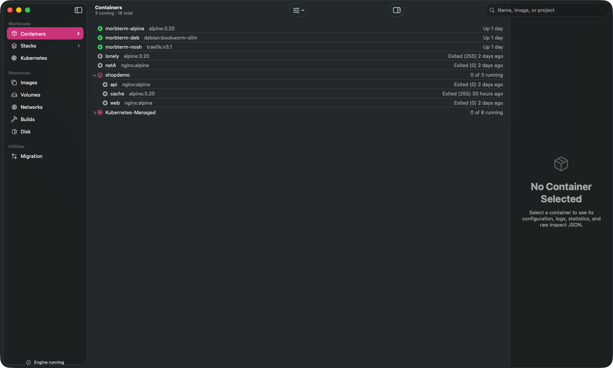
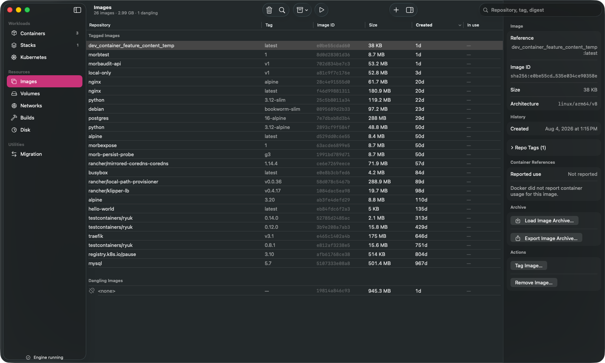
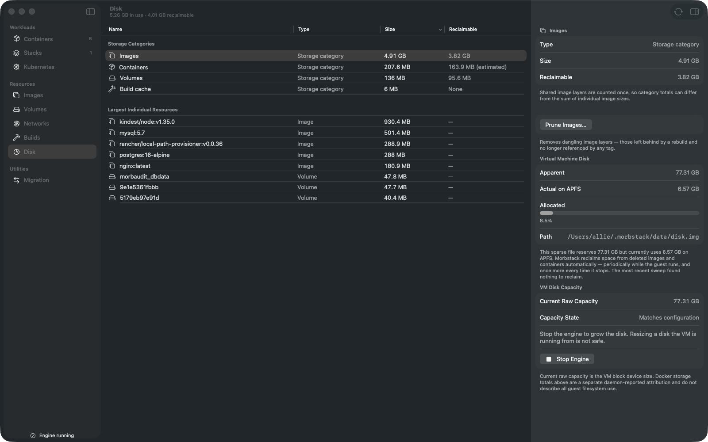
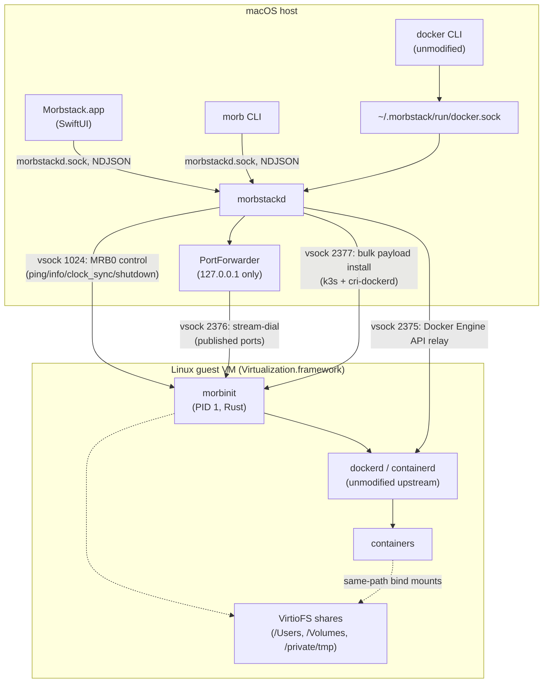

<picture>
  <source media="(prefers-color-scheme: dark)" srcset="brand/out/wordmark-dark.png">
  
</picture>

**The Docker you wish Docker shipped.**

Morbstack is a free, Apache-2.0, native replacement for Docker Desktop on
macOS. It runs unmodified upstream Moby — `dockerd` and `containerd`,
stock, no downstream patch — inside a single shared, lightweight Linux VM
powered by `Virtualization.framework`. Published ports (including
`docker run -P`) are held on the Mac by a small Morbstack userland proxy,
invoked through dockerd's own stock `--userland-proxy-path` hook — no
engine patch required. Everything else — the CLI, the daemon, and the
app — is thin, native Swift glue.

<!--
  TODO(human): the CI badge URL below assumes the repo is published as
  github.com/morbstack/morbstack (see docs/PUBLISHING.md). Update the
  org/repo once that's decided, and this comment stops being needed.
-->
[](LICENSE)
[](https://github.com/morbstack/morbstack/actions/workflows/ci.yml)


- **1.79 s cold boot, 0 % idle CPU — and you can check it yourself.**
  `morb bench run` is the same one-command harness that produced those
  numbers; it measures your own machine rather than asking you to trust
  ours. Full run and methodology: [`docs/audit/ENGINE-MATRIX.md`](docs/audit/ENGINE-MATRIX.md) §10.
- **Free forever**, Apache-2.0 — no license nags, no seat count, no
  "personal use only."
- **No account.** Nothing to sign in to, nothing phoning home to gate a
  feature.
- **No telemetry.** Verified by grepping `mac/Sources` for any
  analytics/telemetry SDK: there isn't one. (The only hits for words like
  "analytics" or "sentry" in that tree are deterministic fixture strings used for
  local app/UI-test data — not code
  that runs, and not data that goes anywhere.)
- **Unmodified upstream Docker Engine.** Morbstack doesn't reimplement
  Docker Engine — it fetches the real static Docker release binaries
  (`dockerd`, `containerd`, `runc`, the `docker` CLI, Compose, Buildx) and
  runs them verbatim, archive-hash-pinned. Published ports are made
  reachable from the Mac by a small Morbstack userland proxy that dockerd
  execs through its own stock `--userland-proxy-path` flag — no engine
  patch, no fork. The API surface, the CLI, and Compose files behave the
  way real Docker does. See [`docs/compat.md`](docs/compat.md).
- **Native SwiftUI, zero web views.** The app is AppKit/SwiftUI, not an
  embedded browser — see "The five differentiation domains" in
  [`docs/architecture.md`](docs/architecture.md).
- **Leaving is one command, and it is tested.** `morb migrate --to
  <runtime|socket>` moves your images and volumes back out to Docker
  Desktop, Colima, OrbStack, or any socket, then verifies every copy with
  a config-ID and sha256sum check before it says done. No other Docker
  Desktop alternative ships a supported way out at all — OrbStack's own
  [issue #2517](https://github.com/orbstack/orbstack/issues/2517) asking
  for one is still open.

## What it looks like

Real windows, captured off a running engine — not mockups, not offscreen
renders. [**The full gallery**](docs/gallery/) covers every route that has been
photographed, and names the ones that haven't.

[](docs/gallery/)

Sixteen containers, eight of them Kubernetes' own `k8s_POD_*` scaffolding — and
the scaffolding is one collapsed row, not eight rows of 60-character names
burying the containers you started. Compose projects group under their own name.
Nothing on this screen is custom chrome: a `NavigationSplitView`, a system list,
and real `docker ps` data.

[](docs/gallery/)

A real `Table` with sortable columns and a real `.inspector`, not a hand-drawn
grid. Architecture is a first-class field, so an `amd64` image is flagged before
you run it rather than after `exec format error`.

[](docs/gallery/)

The number that matters is the pair: the VM disk reserves **77.31 GB** and
actually occupies **7.46 GB** on APFS. Most "why is Docker eating my disk"
confusion is one of those two figures shown alone.

## Status: pre-release (milestone M0)

Morbstack is not yet something you run containers with day to day. There
is no packaged app or DMG yet (see "Install" below), and real gaps remain
— read this section before trying it, not after something breaks.

**What works** is split deliberately between live evidence and newly landed
release plumbing. The historical VM results live in
[`docs/parity.md`](docs/parity.md); implementation that still needs a fresh,
clean-profile VM pass is marked that way rather than promoted to a claim.

- `docker run`, `docker exec`, `docker logs`, `docker cp`, `docker stats`,
  `docker events`, `docker system df/prune` — the core CLI, byte-for-byte
  the same shape of output as real Docker.
- Published ports (`docker run -p`), reachable from the Mac.
- Container outbound networking (NAT) and disk persistence across a
  `morb stop`/`morb start` cycle.
- `docker compose up -d` — multi-service projects, healthchecks,
  `depends_on: condition: service_healthy`, named volumes, custom
  networks.
- VirtioFS bind mounts, same-absolute-path mapping — see
  [`docs/sharing.md`](docs/sharing.md).
- amd64 images via Rosetta — verified with `mysql:5.7`, which ships no
  arm64 manifest at all — see [`docs/amd64.md`](docs/amd64.md).
- A local Kubernetes cluster (`morb k8s enable`), wired to the same
  `dockerd` everything else uses, off by default — see
  [`docs/k8s.md`](docs/k8s.md).
- Docker-in-Docker via the bind-mounted socket, OOM/disk-full failure
  modes matching real Docker's contract, and restart policies surviving
  a daemon restart.
- The development app bundle now carries signed upstream Docker, Compose,
  Buildx, kernel, initramfs, and optional Kubernetes artifacts. The consented
  setup transaction installs only Morbstack-owned links, registers a Docker
  context, and creates `~/.docker/run/docker.sock` only when that conventional
  location is absent and safe to own. **Clean-profile, real-VM evidence is
  still pending** before this is called an out-of-the-box release guarantee.

**What does not work yet** — the honest list, not softened:

- **No packaged app.** You build from source (below). No DMG, no
  Homebrew cask yet.
- **No `morb.local` domains or general split-DNS integration.**
  `host.docker.internal` and `gateway.docker.internal` are the deliberate
  exception: they resolve to the VM NAT gateway inside containers, so they
  reach services listening on the Mac.
- **The per-user background service is implemented, but release evidence is
  pending.** It is an explicit, default-off Login Items choice backed by a
  signed `SMAppService` LaunchAgent; it never starts the VM or containers on
  its own. `morb service status`, `enable`, `disable`, and `settings` are
  available for direct management. The complete clean-profile proof—consented
  registration, app update, engine reachability after the window closes, and
  repair/uninstall behavior—remains a release gate. See
  [`docs/background-service.md`](docs/background-service.md).
- **Buildx is bundled, pending clean-profile evidence.** The app’s Buildx
  plugin is the unmodified upstream binary and setup installs it in Docker’s
  standard plugin location. Its live clean-machine contract is not claimed
  complete until the release matrix proves it against a fresh VM.
- **No inotify across a VirtioFS bind mount.** A host-side edit is
  correct the instant you read it, but hot-reload watchers (`nodemon`,
  `webpack --watch`, `vite`) never see the change-notification event.
  `--legacy-watch`/polling-based watchers work as a mitigation.
- **Custom share lists can still make `/tmp` guest-local.** With the default
  live `/private/tmp` share, the guest aliases `/tmp` to it and bare
  `/tmp/...` bind sources work as they do on macOS. If you remove that share
  or it fails to mount, those sources can still be empty; `morb doctor`
  reports the condition.
- **UDP publishes use the event-confirmed datagram relay.** UDP is loopback-only like
  TCP, and supports real datagram/reply flows once Docker reveals the concrete port;
  it deliberately does not claim TCP-style synchronous reservation for dynamic or
  ranged publishes. `morb.local` DNS/domains remain unavailable.

[`docs/parity.md`](docs/parity.md)'s own tally, from a live audit against
a real guest, not simulated: **20 PASS, 3 PARTIAL, 6 FAIL** out of 29
checks — read it for the full list, including behavioral differences
from real Docker that pass every manual test and then break exactly one
person's CI script (a `docker run -p` against an already-bound host port
succeeds where Docker Desktop fails synchronously, for example).

## Native-window validation

Every image in [`docs/gallery/`](docs/gallery/) is a real window, captured by
[`scripts/capture-window.sh`](scripts/capture-window.sh), which asks WindowServer for one
window's own composited content — so the frame, traffic lights, unified toolbar, sidebar
material, inspector and Liquid Glass in those files are the real thing, and nothing else on
the desktop can leak into the frame.

The repository deliberately does **not** publish synthetic inner-content screenshots as
evidence of the native UI. A headless SwiftUI/AppKit image cannot represent any of the
chrome above, and this project has been misled by one before. `swift run MorbShots`
validates deterministic fixture data only; it writes no images.

For a visual review, launch the app in a real window and inspect it with Computer Use in
both appearances and at normal/narrow widths. The repository also carries a macOS XCUITest
host for repeatable accessibility and screenshot evidence; macOS must authorize Xcode Helper
under Accessibility before it can drive the app. See
[`docs/development/codex.md`](docs/development/codex.md).

## Requirements

- **Apple silicon.** `Virtualization.framework`'s Rosetta-backed amd64
  path and this project's own testing both assume arm64; there is no
  Intel Mac support story.
- **macOS 26 (Tahoe) or later** to run Morbstack — `mac/Package.swift`
  declares a `macOS(.v26)` deployment target and `Info.plist` sets
  `LSMinimumSystemVersion` to `26.0`, so the app adopts Tahoe’s native window
  and Liquid Glass behavior rather than compatibility metrics.
- **Xcode 26 or later** to build it — needed for the Swift 6.3 compiler
  and `Virtualization.framework`.

## Install

**From source, today** — this is the only way to run Morbstack right
now:

```sh
git clone <this repository>
cd morbstack
mise trust && mise install   # one-time: pulls the pinned Rust toolchain
mise run build                # builds morbstackd, morb, and morbinit
mise run test                 # runs the Swift and Rust test suites
```

See "Running" below for the full walkthrough from there to a working
`docker run`.

**A DMG and a Homebrew cask are not available yet.** Packaging and signed
releases are tracked as REL-1 through REL-5 in [`TASKS.md`](TASKS.md); the
blocker is notarization, and an unnotarized DMG is Gatekeeper-blocked for
everyone except whoever built it. Nothing on this page should be read as
"download a build"; there isn't one yet.

## Running

The exact command sequence from a fresh clone to a working
`docker run`/`docker compose` setup:

```sh
mise trust && mise install
mise run build
```

Check the host is capable, and see what setup is outstanding:

```sh
./mac/.build/debug/morb doctor
```

Fetch and hash-verify the pinned guest kernel, Docker engine binaries,
Alpine minirootfs, guest fsutils, and the complete host Docker toolchain
(`docker`, Compose, and buildx) — see [`NOTICE`](NOTICE) for exactly what
these are and where they come from:

```sh
./scripts/fetch-guest-assets.sh
```

On a clean Mac, install that bundled host toolchain with an explicit,
inspectable consent step. It links `docker` into `~/.morbstack/bin`, installs
the standard Docker CLI plugins, and registers the `morbstack` context without
overwriting another named context. See [`docs/first-run.md`](docs/first-run.md)
for every file it may touch and the inverse removal command.

```sh
./mac/.build/debug/morb install-cli --print-plan
./mac/.build/debug/morb install-cli
# Open a new login shell after the PATH step, then use docker normally.
```

Cross-compile `morbinit` and assemble the bootable initramfs:

```sh
mise run guest-image
```

Start the daemon (builds, ad-hoc codesigns with the entitlements needed
to open a VM, and runs it in the foreground — the VM itself doesn't boot
until the first client connects, via socket activation):

```sh
mise run run-daemon
```

In another terminal, use Docker normally (the clean-machine `install-cli`
transaction selected the `morbstack` context):

```sh
docker ps
docker run --rm hello-world
docker run -d -p 8080:80 nginx
curl -fsS http://127.0.0.1:8080   # nginx welcome page, from the Mac
```

If you deliberately kept another Docker context current, use the one-command
override (`DOCKER_CONTEXT=morbstack docker ps`) or switch explicitly with
`./mac/.build/debug/morb context use`.

`docker compose version` and `docker buildx version` should now both work
without a separate plugin-install step.

Full detail, including troubleshooting the `credsStore`/`docker-credential-desktop`
hang and the port-forwarder retry behavior, lives in
[`CONTRIBUTING.md`](CONTRIBUTING.md) and [`docs/architecture.md`](docs/architecture.md).

## Architecture



- **Host**: `Morbstack.app` (a real main window plus a menu-bar extra) and
  the `morb` CLI both talk to
  `morbstackd` over a Unix control socket. `morbstackd` owns the VM's
  lifecycle via `Virtualization.framework`, relays
  `~/.morbstack/run/docker.sock` to the guest over vsock, and mirrors
  published container ports onto `127.0.0.1` (never `0.0.0.0`).
- **Guest**: `morbinit`, a static Rust binary, runs as PID 1, brings up
  networking and the data disk, and supervises unmodified upstream
  `dockerd` and `containerd`. `dockerd` is started with
  `--userland-proxy-path` pointed at a multi-call symlink to `morbinit`
  itself, so every published port is leased from the Mac through a stock
  dockerd hook rather than an engine patch.
- **Wire protocols**: vsock port 1024 carries MRB0-framed JSON guest
  control; port 2375 is a raw relay of the Docker Engine API; port 2376
  is a one-line-handshake stream-dial used for published ports (and the
  Kubernetes API server); port 2377 is a bulk payload-install channel,
  today used only for the optional Kubernetes payload. Full wire-level
  detail in [`docs/protocol.md`](docs/protocol.md).

## How Morbstack compares

A short teaser — the full matrix (Docker Desktop, OrbStack, Colima,
Rancher Desktop) is in [`docs/comparison.md`](docs/comparison.md).

| | Morbstack | Docker Desktop |
|---|---|---|
| Price | Free forever | Free for personal use; paid for larger companies |
| License | Apache-2.0, source available | Proprietary |
| Engine | Unmodified upstream `dockerd` (published ports via stock `--userland-proxy-path`) | Unmodified upstream `dockerd` |
| Host UI | Native SwiftUI | Electron |
| Telemetry | None | Present |

## Documentation

[`docs/README.md`](docs/README.md) is the full index. The short list:

- [`docs/gallery/`](docs/gallery/) — real captures of every route that has
  one, and an honest list of the ones that don't.
- [`docs/architecture.md`](docs/architecture.md) — how the pieces fit and
  why the load-bearing decisions were made that way.
- [`docs/sharing.md`](docs/sharing.md) — file sharing: the same-path
  rule, `shared_paths`, and why an unshared bind mount fails silently.
- [`docs/amd64.md`](docs/amd64.md) — running amd64 images through
  Rosetta, and what the qemu fallback does not yet cover.
- [`docs/protocol.md`](docs/protocol.md) — the vsock wire protocols.
- [`docs/dynamic-port-allocation.md`](docs/dynamic-port-allocation.md) — the
  truthful allocation boundary for dynamic published ports.
- [`docs/compat.md`](docs/compat.md) — the drop-in compatibility
  contract and CI-enforced ecosystem matrix.
- [`docs/parity.md`](docs/parity.md) — a live, honest audit of where
  "same Docker CLI, same everything" holds today and where it doesn't.
- [`docs/k8s.md`](docs/k8s.md) — the local Kubernetes cluster.
- [`docs/roadmap.md`](docs/roadmap.md) — milestones and the public
  performance-target table.
- [`docs/comparison.md`](docs/comparison.md) — the full comparison
  matrix against Docker Desktop, OrbStack, Colima, and Rancher Desktop.

## Contributing

See [`CONTRIBUTING.md`](CONTRIBUTING.md) — development environment
setup, the DCO sign-off requirement, build/test commands, code style,
and the PR process. [`CODE_OF_CONDUCT.md`](CODE_OF_CONDUCT.md) applies to
all project spaces.

## Security

See [`SECURITY.md`](SECURITY.md) for the threat model, what's in and out
of scope, and how to report a vulnerability privately. Please do not
open a public issue for a security finding.

## License

Apache-2.0. See [`LICENSE`](LICENSE) and [`NOTICE`](NOTICE) — the latter
lists every third-party component Morbstack's build/runtime tooling
fetches (kernel, Alpine rootfs, Docker engine, k3s, cri-dockerd, and
more) and is explicit about what is and isn't redistributed by this git
repository itself.

---

**Everything that runs on your machine is free forever.**
