# Gallery

Real windows, real data — a live `shopdemo` Compose project (five current services, one
publishing two TCP ports, one publishing UDP), three standalone containers reused across
sessions (`web-front`, `cache-node`, `dns-probe`), a real Kubernetes workload contributing
sixteen more, a real BuildKit cache, and 38 containers total on a working engine. Stills are
captured with [`scripts/capture-window.sh`](../../scripts/capture-window.sh), which grabs a
single window's own composited content rather than a screen region, so nothing else on the
desktop can leak in. This pass adds the same guarantee for motion:
[`scripts/capture-gif.sh`](../../scripts/capture-gif.sh) loops that exact `screencapture -l`
call into a frame sequence and assembles it into a GIF with ImageIO — still one window's own
buffer, never a screen region (`-R`) and never a full-display recording (`-V`); see that
script's header for why both are refused. `screencapture -l` is slow — this machine achieved
roughly 0.25–2.1 s per frame depending on how much the window had to redraw — so every GIF
below declares the frame delay actually measured for its own capture run rather than a
hoped-for rate, and several hand-pick a handful of the captured frames rather than replaying
all of them, to keep file size down without changing what any single frame shows.

**Nothing here is staged, retouched or cropped to hide anything.** Where a screen still has a
known defect it is either absent from this page or the defect is named below it. This project
has spent real effort undoing claims that outran the code; a screenshot is a claim like any
other.

This pass also required teaching the tour tooling to reach screens that only open as their own
window or their own inspector tab — `--tour-tab`, `--tour-stat-metric`, `--tour-open-terminal`
and `--tour-project-logs`, alongside the existing `--tour-container` — so a container's Files
and Statistics tabs, its terminal window, and a Compose project's log window can all be reached
without a click. `scripts/ui-tour.sh` now forwards any argument past the first three straight
to the app. See `LaunchOptions` in `App.swift`/`AppModel.swift`.

Two routes below are deliberately absent rather than stale: **Kubernetes**, because a different
session is actively driving Kubernetes work on this same machine this session was asked not to
collide with, and the **menu-bar extra**, which only opens by clicking its status-bar icon and
has no scriptable equivalent. Both are named honestly under
[Not yet captured](#not-yet-captured) instead of being left under an old caption pretending to
be current.

A fuller set, including light appearance and narrow widths, lives in `artifacts/` and is
deliberately untracked — it is regenerated every review pass.

---

### Containers, grouped by Compose project

16 running, 38 total. `shopdemo` collapses to a disclosure row headed **5 of 8 running** —
Compose has seen eight service names under that project across this sandbox's repeated demo
runs, five of them currently up — and **Kubernetes-Managed** collapses its own sixteen
`k8s_POD_*`/`k8s_*` containers into one row headed **8 of 16 running**, rather than burying the
containers someone actually typed `docker run` for under sixty-character machine names. Toolbar
search is now a glyph: the magnifying glass next to the inspector toggle, not a field in the bar
— no route keeps a permanent search field any more. The remaining toolbar controls sit in two
glass capsules at the trailing edge: the filter menu alone at the head of the run (a `Menu` is
the one thing that splits a placement run, so it moved there instead of fragmenting the group
behind it), record actions/search/inspector-toggle together in the second capsule.

### Containers, a selected record's detail tabs

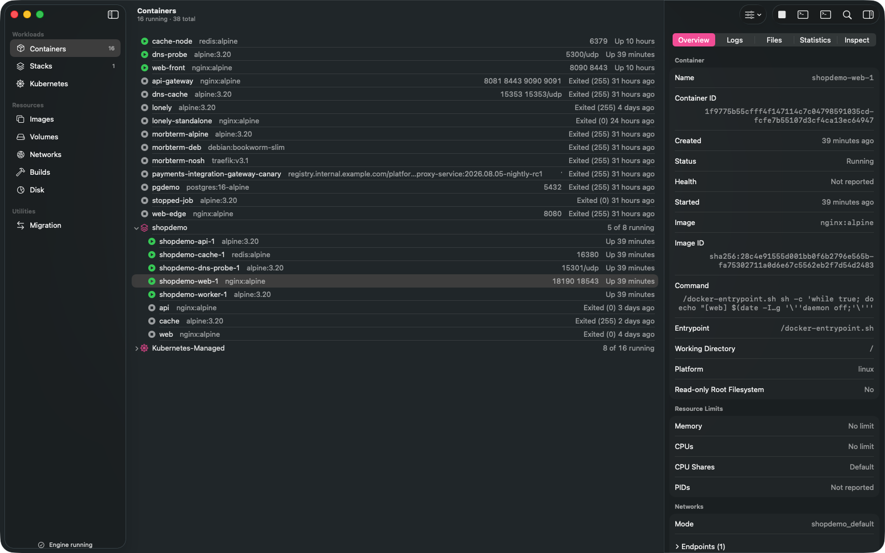

`shopdemo-web-1` selected. The five tabs — Overview, Logs, Files, Statistics, Inspect — are now
a segmented `Picker`, not a `TabView` (UI-055): a `TabView` inside `.inspector` draws a bordered
content box whose leading edge overdrew the inspector's own divider, measured at the seam as a
real pixel difference (`444f51` vs `61686b`) and reproduced in stock SwiftUI before the fix. The
inspector also now renders at its declared width — `.inspectorColumnWidth(min: 340, ideal: 400,
max: 520)` was previously discarded because the modifier sat underneath `.toolbar`/`.searchable`
instead of outermost on the inspector's content, so every route was stuck at SwiftUI's ~270 pt
default and clipping values ("Running" as "Runnin", "linux" as "linu"). Nothing here is clipped.

### Containers, the inspector's reveal

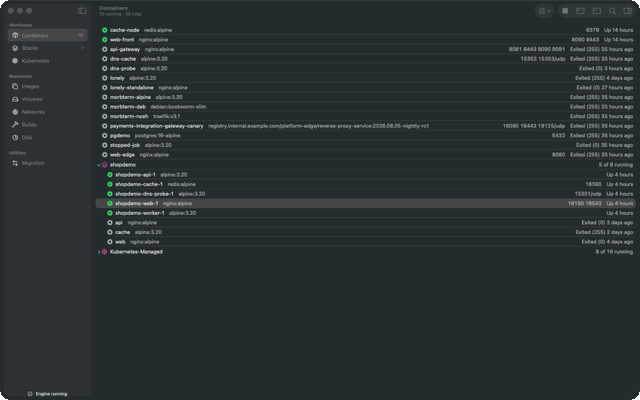

`shopdemo-web-1` selected, six real `screencapture -l` frames at ~340 ms apart (this machine's
measured rate for this window). This animates a defect this project investigated and then
closed as a **platform limitation, not a bug** (UI-056, `TASKS.md`): closing the trailing
`.inspector` slides; opening it does not, because AppKit's own reveal work — Auto Layout,
`NSTableRowView` management, Objective-C runtime/ARC churn, CoreAnimation commit — costs
several hundred ms of synchronous main-thread time on macOS 26.4, consuming the entire
animation's frame budget before SwiftUI has a frame left to interpolate. It reproduces
identically in a three-row stock `Form` with zero Morbstack code
(`docs/design/tahoe/HIG-FINDINGS.md`), on the sidebar toggle, and on every route's inspector
regardless of content size, so there is no content-layer fix on file for it. What this GIF
actually shows, frame by frame: two frames closed, then the panel already fully open and
settled by the very next capture — sometimes (run-to-run) an intermediate frame catches the
column mid-width with values still clipped before layout finishes, sometimes the whole
transition lands between two 340 ms-apart captures and reads as a hard cut. Either way, no
frame here shows a smooth interpolated slide, because the real animation does not produce one.

### Containers, the Files tab on a real container

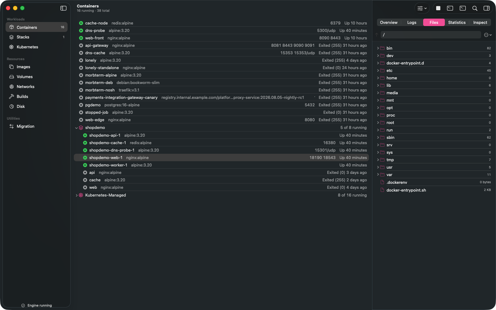

`shopdemo-web-1`'s actual root filesystem (UX-4), read live through
`HEAD /containers/{id}/archive?path=X` with no exec and no shell in the container — `bin`,
`dev`, `etc`, `docker-entrypoint.d`, real entry counts per folder, `.dockerenv`,
`docker-entrypoint.sh`. Reached this pass via `--tour-tab files`, not a click.

### The container terminal, a live shell

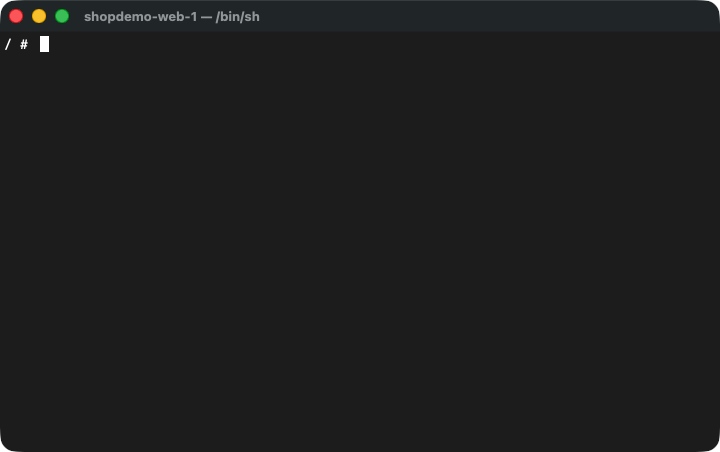
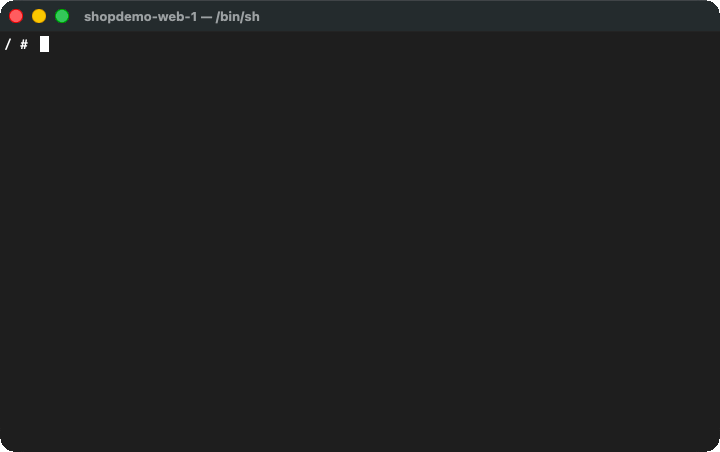

An interactive `exec` session connected to `shopdemo-web-1` — the window title tracks the
resolved shell (`shopdemo-web-1 — /bin/sh`) and the prompt (`/ #`) with a live cursor is real
output from the container, not a placeholder. Opened this pass with `--tour-open-terminal`,
which calls the same `ContainerTerminalWindowController.open(for:client:)` the toolbar button,
context menu, and ⌃⌘T all call. The GIF types `for i in 1 2 3 4 5; do echo tick $i; sleep 0.6;
done` into that live session — keyboard input reaches the app from automation, mouse clicks do
not (see the inspector-reveal note above and `ContainersRootView.swift`'s comment on the same
limitation) — and shows five real `tick N` lines actually arriving from the container's shell
one at a time, not a canned transcript.

### Containers, the Compose-aggregated log window

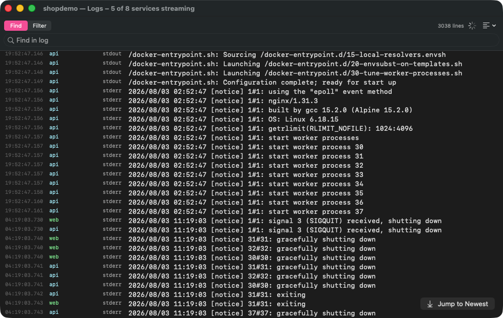
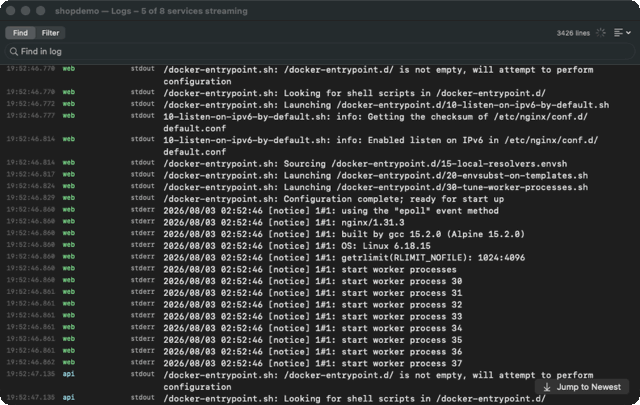

The `shopdemo` project's merged log (UX-2/UX-3), opened this pass with `--tour-project-logs
shopdemo`: five services' `stdout`/`stderr` interleaved by real arrival time, each line
colour-coded and labelled by service, 3,038 lines and counting. **A real defect this capture
caught**: the window opens scrolled to the oldest lines still in the buffer rather than the
newest, even though the surface declares `.defaultScrollAnchor(.bottom)` and an
auto-follow-on-append rule — the `Jump to Newest` button stays visible instead of the tail. Not
fixed in this pass; worth its own ticket. The header's "5 of 8 services streaming" reflects the
same repeated-demo-run history as the Containers screen above, not a bug in the header itself.

The GIF, captured for this pass, extends that same finding rather than hiding it: frame 1 is
the stale open-to-old-lines state above; a scripted click on `Jump to Newest` (AXPress, not a
mouse click) reaches the real interleaved tail by frame 3 — `web`/`api`/`worker`/`dns-probe`
lines genuinely arriving during the capture, colour-coded, real timestamps. Frame 4, roughly
20 real seconds later with the line counter risen from 3,434 to 3,454 lines, shows **the exact
same visible lines as frame 3** — the one-time manual jump does not turn into ongoing
auto-follow, so the view drifts stale again immediately and `Jump to Newest` never disappears.
Confirms the auto-follow-on-append rule is not just failing on first open; it does not fire on
append at all in this window.

### Containers, the Statistics tab's network rate chart

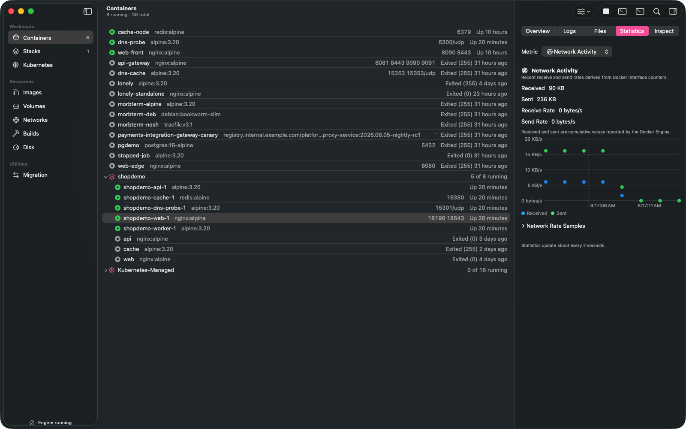
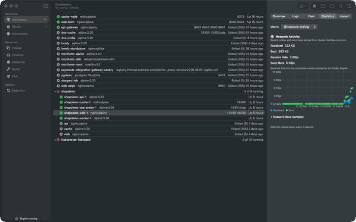

`shopdemo-web-1`, Network Activity selected via `--tour-stat-metric network` — reachable in the
app today only by a click on the Metric picker until this pass added the flag. Received/Sent are
cumulative Engine counters (90 KB / 236 KB here); the chart plots the derived per-interval rate,
visibly spiking to the mid-teens of KB/s while this capture ran repeated `curl` requests against
the container's published port and settling back to zero once they stopped — a real, driven
signal, not a static mock. The GIF is eight frames picked out of a real ~24 s capture (the
route polls every 2 s, stated on-screen) while a fresh `curl` loop ran against the container's
published port: Received climbs 332 KB → 348 KB → 363 KB, Send/Receive Rate move between 2–5
KB/s, and the dot cluster at the chart's right edge visibly grows — not a looped clip.

### Containers, the Statistics tab's disk rate chart

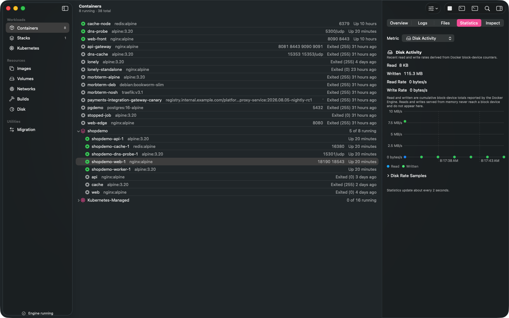
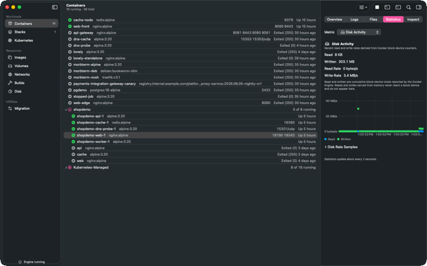

The same container, Disk Activity via `--tour-stat-metric disk`. Written climbs to 115.3 MB and
the chart shows a real spike from a `dd if=/dev/zero` run inside the container moments before
the capture, tapering to zero as the write finished — reads and writes served from page cache
never reach a block device and correctly never appear here, which the section's own footnote
states. The still's single spike is brief enough that a first attempt at an animated version
(one burst of `dd` calls) had already finished writing before the frame loop caught up to it —
a real limit of a ~1–2 s-per-frame capture rate against a write that completes in one polling
interval. The GIF instead drives a steadier load (repeated small `dd ... conv=fsync` writes,
~2.5 MB every 0.4 s) so the rate stays visibly non-zero across the whole capture: seven frames
over ~15 s real time, Written 303.1 MB → 326.1 MB → 351.3 MB, Write Rate holding in the
2.6–3.7 MB/s band, x-axis timestamps advancing — genuine sustained motion, not the single-spike
shape the still documents.

### Stacks

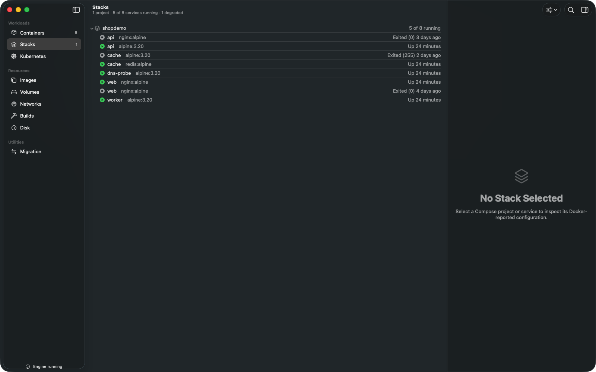

`shopdemo` expanded by default, headed **5 of 8 services running · 1 degraded**. Eight service
rows, not five, because this sandbox has run the same Compose project name more than once
without cleanup — three exited rows (`api`, `cache`, `web`, no `-1` suffix) are leftovers from an
earlier untagged run sitting beside the five current `-1`-suffixed ones. Real, if untidy, data:
nothing here was trimmed to look cleaner than the engine's own history. The toolbar carries only
the filter menu and search glyph now; Stacks' three separate menus from before this session
merged into one `Divider`-sectioned menu (UI-054).

### Images

31 images, 4.99 GB, 2 dangling. **In use** now shows real counts (0, 2, 8, 9…) instead of an
em-dash in every row — but only because this capture ran with `--tour-warm-disk-scan`, which
fires the same `/system/df` fetch a visit to Disk would. `GET /images/json` reports every
container count as `-1` on this engine, so the column is filled in from the most recent Disk
scan the same way Volumes' Size/In use columns are (`AppModel.mergeImageUsageFromDisk`); a
session that opens straight into Images without ever visiting Disk still shows every row as
unscanned, which is the honest state and the reason TASKS.md's TASTE-5 is still open rather than
closed by this screen alone.

### Disk

**5.26 GB in use, 4.01 GB reclaimable** across Images (4.91 GB / 3.82 GB), Containers (207.6 MB
/ 163.9 MB estimated), Volumes (136 MB / 95.6 MB) and Build cache (6 MB / none). The VM disk
section now states reclaim is automatic and names the outcome of the last sweep in one sentence
— "Morbstack reclaims space from deleted images and containers automatically — periodically
while the guest runs, and once more every time it stops. The most recent sweep found nothing to
reclaim." — replacing copy that used to describe the recovery state machine itself. Apparent
77.31 GB against 6.57 GB actually on APFS is the pair that answers "why is Docker eating my
disk" on its own.

### Volumes

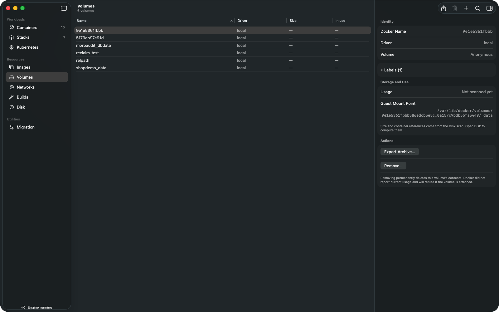

Unchanged pattern, still correct: **Size** and **In use** are blank because Docker's volume list
never reports them, and the inspector says so once — *"Size and container references come from
the Disk scan. Open Disk to compute them."* — rather than printing a zero. This session's capture
never visited Disk first, which is why Volumes stays unscanned even though Images (captured with
`--tour-warm-disk-scan`, above) does not; the two screens are consistent with each other once you
know which one asked for the scan.

### Networks

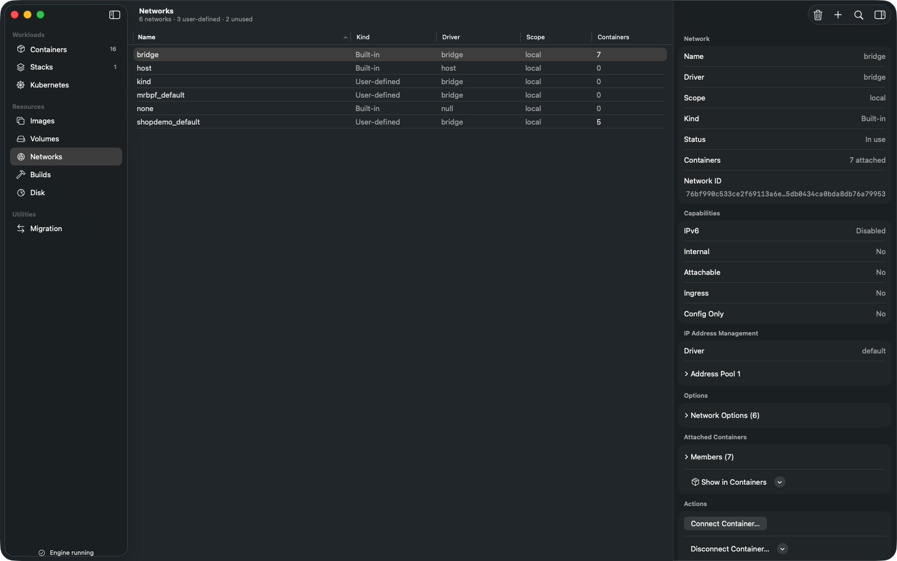

Six networks, three user-defined, two unused. `bridge` selected: Kind **Built-in**, seven
attached containers, full IPAM/capabilities/options detail, and **Show in Containers** to jump
straight to the seven members (the real `bridge` network holding `shopdemo`'s services and the
standalone containers together).

### Builds

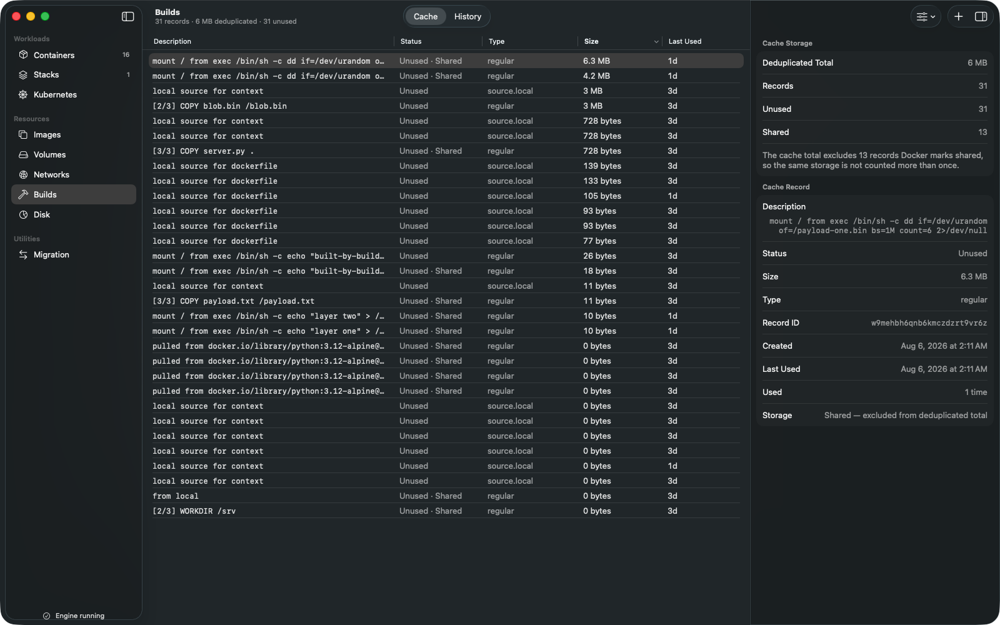

31 cache records, 6 MB deduplicated, 31 unused — a real cache from real `docker build` runs
against this engine. The **Cache/History** segmented picker sits centred in the toolbar; the
inspector shows both the aggregate (Deduplicated Total, Records, Unused, Shared, with a footnote
explaining the 13 records Docker marks shared are excluded from the deduplicated total so the
same storage is not counted twice) and the selected record's own detail (status, size, type,
record ID, created/last-used timestamps, use count, and whether its storage is exclusive or
shared).

### Migration

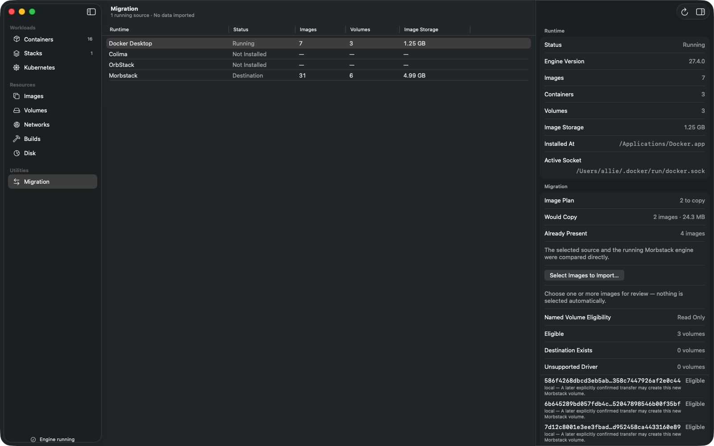

Previously unphotographed — the ninth sidebar route, now populated: Docker Desktop detected as a
running source (7 images, 3 volumes, 1.25 GB, engine 27.4.0) compared directly against the
running Morbstack engine as destination (31 images, 6 volumes, 4.99 GB). The image plan states
what a copy would actually do — **2 to copy, 4 already present** — before anything is selected,
and the volume eligibility table gives per-volume reasons (3 eligible, 0 already existing at the
destination, 0 on an unsupported driver) rather than one blanket verdict.

---

## Not yet captured

- **Kubernetes.** A different session is actively driving Kubernetes work on this machine this
  pass, and was asked explicitly not to collide with it, so the route was skipped entirely
  rather than risk racing that work. The previous `kubernetes.png` in this gallery documented a
  now-fixed ECDSA/`SecKeyCreateWithData` credential defect and is now doubly stale — both its
  toolbar chrome (pre-UI-051/UI-055) and its cluster data predate this session. Left out rather
  than published under a caption it no longer earns.
- **The menu-bar extra.** Real and reachable in the running app, but it only opens by clicking
  its status-bar icon; there is no `--tour-*` or scriptable equivalent, and this pass's rule was
  no computer-use tools. The previous `menubar.png` predates this session's toolbar and inspector
  changes and is not republished here as current evidence.
- **The Compose log window's initial scroll position** (named above, under Containers) is a real
  defect, not a missing capture, but it was caught rather than fixed in this pass.
- **Animated capture exists for five surfaces so far** (the inspector's reveal, the container
  terminal, the Compose log window, and both Statistics rate charts) — the ones judged to
  actually read as motion worth watching. Stacks, Images, Disk, Volumes, Networks, Builds and
  Migration are stills only; nothing about them is inherently unanimatable, they simply were not
  judged to need it this pass.
