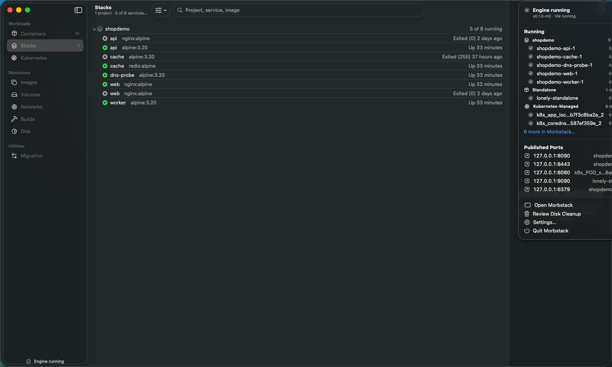
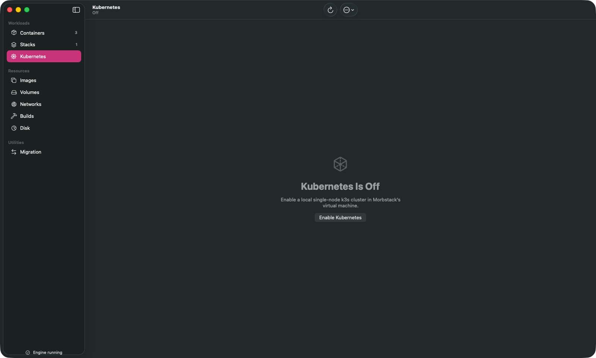

# Gallery

Real windows, real data — a live `shopdemo` Compose project (5 services, one publishing two TCP
ports, one publishing UDP), a running k3s cluster, a real BuildKit cache, and 36 containers total on
a working engine. Captured with
[`scripts/capture-window.sh`](../../scripts/capture-window.sh), which grabs a single window's own
composited content rather than a screen region, so nothing else on the desktop can leak in.

**Nothing here is staged, retouched or cropped to hide anything.** Where a screen still has a known
defect it is either absent from this page or the defect is named below it. This project has spent
real effort undoing claims that outran the code; a screenshot is a claim like any other.

One route below — Kubernetes — is shown in a genuinely broken state, not an empty-by-design one; the
caption says exactly what is wrong and what was and was not fixed. Nothing here was filled in to
make a page look busier. Where a route has more to show than the capture caught, that is stated in
the caption and listed under [Not yet captured](#not-yet-captured).

A fuller set, including light appearance and narrow widths, lives in `artifacts/` and is
deliberately untracked — it is regenerated every review pass.

---

### Containers, grouped by Compose project

The list groups by Compose project — `shopdemo` holds its five services — and collapses
Kubernetes' own scaffolding into a single **Kubernetes-Managed** row. `shopdemo-web-1` publishes two
TCP ports (8090, 8443) and `shopdemo-dns-probe-1` publishes UDP (5300/udp), both visible in the Ports
column without opening the row. The running/stopped dot, the relative uptime and the project heading
are doing all the work; there is no custom chrome on this screen at all. The toolbar is this
session's other change: the search field sits centred (`.searchable(placement: .toolbarPrincipal)`),
the filter menu immediately left of it, and `+`/inspector-toggle at the far right, against the
inspector edge — see [`../../TASKS.md`](../../TASKS.md)'s UI-051 entry for the mechanism and why the
previous trailing-edge placement read as a detached strip.

### Containers, a selected record's detail tabs

`shopdemo-web-1` selected, showing the detail pane's five tabs — Overview, Logs, **Files**,
**Statistics**, Inspect. This capture also proves a real, reproducible bug found and fixed this
session: `.inspectorColumnWidth(min: 340, ideal: 400, max: 520)` was declared but not honored — the
column rendered at SwiftUI's undeclared system default (~270pt) on *every* route in the app, not just
this one, clipping "Running" to "Runnin", "linux" to "linu", "Default" to "Defau" and so on wherever a
value's `Text` had no explicit `.lineLimit`. The cause: the modifier was applied *underneath*
`.toolbar { … }` and `.searchable(…)` in the inspector's content closure rather than as the outermost
modifier on that content. Apple's own documentation says to "apply this modifier on the content of a
`.inspector(isPresented:content:)`" — with other modifiers chained after it, it no longer was that
content's outermost modifier, and its preferred-width preference was silently discarded. Moving it to
the end of the chain (verified against this real window, before/after, with no other change) took the
column from 269pt to the declared 400pt ideal. Fixed identically in all eight routes that had the same
copy-pasted ordering (`ContainersRootView`, `BuildsRootView` ×2, `DiskRootView`, `ImagesRootView`,
`KubernetesRootView`, `MigrationRootView`, `NetworksRootView`, `StacksRootView`, `VolumesRootView`).

### Containers, the Files tab on a real container

`shopdemo-web-1`'s actual root filesystem (UX-4), read live through
`HEAD /containers/{id}/archive?path=X` with no exec and no shell in the container — `bin`, `dev`,
`etc`, `docker-entrypoint.d`, real entry counts per folder, `.dockerenv`, `docker-entrypoint.sh`.

### The container terminal, a live shell

An interactive `exec` session actually connected to `shopdemo-web-1` — the window title tracks the
resolved shell (`shopdemo-web-1 — /bin/sh`) and the prompt (`/ #`) is real output from the container,
not a placeholder.

### Containers, the Compose-aggregated log window

The `shopdemo` project's merged log (UX-2/UX-3): five services' `stderr` interleaved by real arrival
time, each line colour-coded and labelled by service (`api`, `web`, …), the window title stating how
many of the project's services are currently streaming ("5 of 8 services streaming"), 3,560 lines and
counting.

### Stacks

A Compose project's services *are* its content, so projects open by default and the header carries
the fact you would expand it for — **5 of 8 running**. Each service shows its image and status, the
same handful `docker ps` shows, so the screen answers "what is this and is it up" without a click.

### The menu-bar extra, expanded

UX-10's depth: containers grouped by Compose project (`shopdemo`, 5 of them) and by origin
(**Standalone**, **Kubernetes-Managed** with an 8-more overflow), and a **Published Ports** section
naming which container owns each forwarded port — real ports from the same `shopdemo` project shown
above. It stays a menu, not a second dashboard.

### Images

A real `Table` with sortable columns, dangling images in their own section, and an inspector showing
the reference, image ID, size, architecture and container references. The architecture row matters on
Apple silicon: an `amd64` image is flagged before you run it, rather than failing later with
`exec format error`.

### Disk

Storage by category and the largest individual resources, with the VM disk's real numbers beside
them — **apparent size versus actual APFS usage**, which are wildly different for a sparse image and
are the source of most "why is Docker eating my disk" confusion. The prune action states exactly
what it will and will not remove.

### Volumes

The interesting part of this one is the two em-dashes. **Size** and **In use** are blank because
Docker's volume list does not report them, and the inspector says so in as many words — *"Size and
container references come from the Disk scan. Open Disk to compute them."* — rather than printing a
zero and letting you believe it. `Usage` reads **Not scanned yet**, not `0 B`. Remove explains that
Docker will refuse if the volume is attached, and that it cannot tell you what is in there first.

### Kubernetes

**This screenshot is stale evidence of a now-fixed defect; kept here because the live route still
has not been recaptured.** The cluster behind this screen was enabled and healthy — `morb k8s status`
reported `1 of 1 node ready`, `4 of 4 pods ready`, matching the header — and a real `kubectl` against
the same kubeconfig file worked. But the app's own resource reader could not authenticate to it.
Two compounding bugs, found and fixed in two sessions:

1. `KubernetesAPICredential` built a `SecIdentity` from the kubeconfig's client certificate and key,
   and assumed an RSA key. k3s (Morbstack's bundled Kubernetes) issues ECDSA keys by default. Fixed by
   reading the PEM header instead of hardcoding `kSecAttrKeyTypeRSA`.
2. Fixing (1) alone did not fix the route: `SecKeyCreateWithData` does not take the same byte layout
   for every key type. The code was feeding it the SEC1 ASN.1 DER a `-----BEGIN EC PRIVATE
   KEY-----` document actually contains — correct for RSA (whose PKCS#1 DER *is* the layout
   `SecKeyCreateWithData` wants) but wrong for EC, which needs Apple's own ANSI X9.63 external
   representation instead (`04 || X || Y || K`: the public point from `SecCertificateCopyKey` +
   `SecKeyCopyExternalRepresentation`, concatenated with the private scalar read out of the SEC1
   document). Feeding it SEC1 bytes made `SecKeyCreateWithData` fail outright — reproduced against the
   real on-disk kubeconfig standalone (`SecKeyCreateWithData` returns `nil` on the old bytes, succeeds
   on the converted ones) and confirmed the fix is not just "compiles": the resulting `SecKey` passed
   to `SecIdentityCreate` together with the certificate now succeeds, which only happens when the
   private key mathematically corresponds to the certificate's public key.

`SecIdentityCreate` itself was never the fault; it was correctly reporting "these do not match" for
malformed key bytes, exactly as its own documentation says it will. What was not verified this session:
a live end-to-end HTTP round trip against the real API server, because the cluster was disabled
(nothing listening on `127.0.0.1:6443`) at fix time — connecting failed with a plain TCP
connection-refused, a different and expected failure distinct from the TLS/identity failure being
fixed. Turning the cluster on to get a full round trip is an engine-lane operation outside this
session's scope; the live resource list in this screen is still not recaptured. The picker at the
toolbar's centre (Pods/Nodes, a `.principal` item) and the search field this session moved to
`.toolbarPrincipal` cannot be shown coexisting as a result — this screen is the one case where the
data path that mounts search never renders.

### Networks

Built-in and user-defined networks, told apart by a **Kind** column rather than by folklore about
which names are special. The inspector carries driver, scope, network ID, capabilities, IPAM pools,
options and the five attached containers (the real `bridge` network, holding `shopdemo`'s services
plus the standalone containers), with **Show in Containers** to jump straight to them.

### Builds

A real, populated cache — 31 records, 6 MB deduplicated, from real `docker build` runs against this
engine (one with `--no-cache` specifically to produce unshared, attributable bytes). This capture
also proves a real, reproducible bug found and fixed this session: on first navigation to this route
directly (which is what happens whenever it is the last-viewed route, or is opened via
`--tour-select`), the cache load raced the daemon's first engine-status round trip and silently never
retried, leaving a truthful-looking but wrong "No Build Cache" empty state forever. Fixed by folding
`engine.isRunning` into the `.task(id:)` that gates the fetch, in `App.swift`, alongside the same
latent bug on the Disk route. The **Cache/History** segmented picker (`.principal`) sits left of
centre and the search field (`.toolbarPrincipal`) sits right of it in the same centre run, answering
this session's one open toolbar question: the two placements share the region sequentially rather
than colliding.

---

## Not yet captured

Everything above is a real window. These are real screens too, but nobody has photographed them, so
this page says nothing about how they look:

- **Kubernetes, resources actually listed** — the credential defect described above is now fixed and
  verified standalone, but the cluster was disabled at fix time, so the live route itself is still
  unphotographed.
- **Migration** — the ninth sidebar route, which compares another runtime's images against
  Morbstack's and imports selected ones ([`../migrate.md`](../migrate.md)).
- **The Statistics tab's charts** (network + disk I/O rates, UX-9), reachable in the app right now but
  not driven to in any pass yet.
- **Settings and the light appearance** of every route above.

**How the container terminal, Files tab, and Compose log window captures above were actually taken.**
An earlier pass in this project had no Computer Use access and no Accessibility permission for
`osascript`/System Events, so it tried to select a real (non-fixture) container by clicking a `List`
row through XCUITest and found that unreliable — a synthetic click that silently failed to select,
followed by an arrow-key fallback, was once observed to move the *sidebar's* selection instead. The
fix was to stop clicking the row at all: `--tour-container <name>` (already used throughout this page
for `shopdemo-web-1`) preselects the record before the window even appears, so XCUITest only ever has
to click a stable, already-onscreen control by accessibility identifier — the Files tab, the Open
Terminal toolbar button, a project group's context menu — never a list row. That is what
`testEvidenceTerminalFilesTabAndComposeLogs` in `mac/UITests/MorbstackFixtureUITests/…` does, against
the real engine (`shopdemo-web-1` running, the `shopdemo` project up), with no fixtures involved.

**There are no animated captures.** No `.gif` or video exists anywhere in this repository, and
nothing on this page is a still frame lifted from one.
[`scripts/capture-window.sh`](../../scripts/capture-window.sh) takes single stills via
`screencapture -l` and has no frame loop; recording a real interaction would need a separate capture
path — a timed still sequence assembled into a GIF, or a WindowServer screen recording scoped to the
one window. Until that exists, this page shows what a window looked like, not what using it feels
like, and it will not pretend otherwise.
